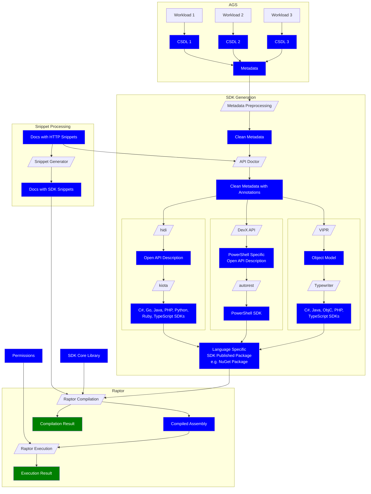
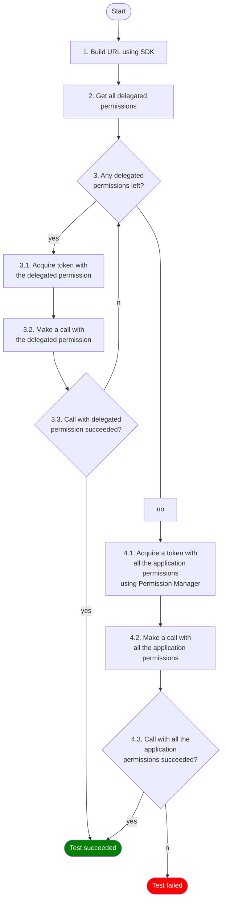

# msgraph-sdk-raptor

## Table of Contents
* [Overview](./README.md#overview)
* [Debugging locally in VSCode and in Github Codespaces](./README.md#how-to-debug-in-vscode-locally-or-in-github-codespaces)
* [Pipelines](./README.md#pipelines)
* [Known Issue Distribution and Detailed Description Tables](./README.md#known-issue-distribution-and-detailed-description-tables)
* [Onboarding New Language Onto Raptor](./README.md#onboarding-new-language-onto-raptor)
* [Defining a Compilable Unit ](./README.md#defining-a-compilable-unit)
* [Raptor in Microsoft Graph Ecosystem Diagram](./README.md#raptor-in-microsoft-graph-ecosystem)
* [Permissions in Raptor](./README.md#permissions-in-raptor)
  * [Periodic Tasks to Update Permissions](./README.md#periodic-tasks-to-update-permissions)
* [Snippets as Raptor's Input](./docs/snippets-as-raptor-s-input.md)

## Overview
This repository consists of test projects which are broadly categorized into 2.

1. compilation tests
2. execution tests

The compilation tests, test the successful compilation of the language-specific snippets from Microsoft Graph documentation. For each snippet, there is an NUnit test case that outputs compilation result i.e whether a test compiled successfully or not.

The execution tests, other than testing compilation of the snippets, use the compiled binary to make a request to the demo tenant and reports error if there's a service exception i.e 4XX or 5xx response. Otherwise reports success.

A test result for both compilation and execution tests includes:
- Root cause, if it is a known failure
- Documentation page where the snippet appears
- Piece of code that is to be compiled with line numbers
- Compiler error message

There are 8 C# test projects in total as noted below. The first 4 C# tests below are compilation tests, the next 2 are execution tests and finally an arbitraryDllTest.

1. CsharpBetaTests
2. CsharpBetaKnownFailureTests
3. CsharpV1Tests
4. CsharpV1KnownFailureTests

5. CsharpBetaExecutionTests
6. CsharpV1ExecutionTests

7. CSharpArbitraryDllTests
8. TypeScriptV1Tests

 The arbitraryDllTest is useful in running customized tests for an unpublished dll, which can consist of a proposed metadata or generator changes.

There are also 4 Java test projects, as listed below. These are all compilation tests

1. JavaBetaTests
2. JavaBetaKnownFailureTests
3. JavaV1Tests
4. JavaV1KnownFailureTests

Powershell has 4 execution test projects, as listed below.

1. PowerShellBetaExecutionTests
2. PowerShellBetaExecutionKnownFailureTests
3. PowerShellV1ExecutionTests
4. PowerShellV1ExecutionKnownFailureTests

**NB: Typescript Tests**
TypeScriptV1Tests relies on npm libraries that are not yet released. In order to execute these tests locally, users will be required to build kiota based npm packages and publish them locally.
You will also be required to install [Typescript](https://www.npmjs.com/package/typescript) in your developer environment

## How to debug in VSCode locally or in Github Codespaces

### Codespaces SetUp

1. Set two environment variables, either locally or in your [codespaces settings](https://github.com/settings/codespaces)
     - `BUILD_SOURCESDIRECTORY`: Where the documentation repository will be checked out. Value should be `/workspaces` for Codespaces.
     - `RAPTOR_CONFIGCONNECTIONSTRING`: Connection string to Azure App Configuration containing settings for execution. An empty App Config works fine for compilation tests.
2. Create a new codespace or open cloned msgraph-sdk-raptor folder in VSCode
3. Make sure to use PowerShell (pwsh) as your terminal (automatic in Codespaces)
4. Make sure that the C# compilation tools are installed (automatic in Codespaces)

### VS Code SetUp

1. Clone documentation repo using the predefined task:
    - open Command Palette (`Ctrl + Shift + P` or `Cmd + Shift + P`)
    - select `Run Task`
    - select `checkout docs repo`
    - select your branch from docs, leave `main` if you want to keep default branch
    - confirm with `YES`
      - confirmation is to prevent deleting local changes in case of subsequent runs of the task
1. Build the solution
    - open Command Palette
    - select `Run Task`
    - select `build`
1. Run all the tests from a single project (e.g. CsharpV1Tests)
    - open Command Palette
    - select `Run Test Task`
    - select `Run CsharpV1Tests`
    - hit Enter when test filter option shows `.` (i.e. all the tests)
1. Run individual tests
    - open Command Palette
    - select `Run Test Task`
    - select `Run CsharpV1Tests`
    - enter a test name filter, e.g. `workbook`
1.  Debug individual tests
    - Open Command Palette
    - select `Run Test Task`
    - select `Debug CsharpV1Tests`
    - enter a test name filter, e.g. `get-workbookcomment-csharp-V1-compiles`
    - there will be a process id to attach to in terminal output e.g.:
      ```
      Process Id: 24536, Name: dotnet
      ```
    - start debugger using `.NET Attach`
    - select process from the terminal output in the process dropdown
    - find bugs and fix them :)


## Pipelines
The repository also contains a couple of CI pipelines. The CI pipelines run the tests outlined above and the output of these tests are then used to report success or failure rates in a graphical and analytical approach.
The pipelines are running in a private Azure DevOps instance [here](https://microsoftgraph.visualstudio.com/Graph%20Developer%20Experiences/_build?view=folders&treeState=XFJhcHRvcg%3D%3D)
There exist pipelines that run when a PR is created on `msgraph-sdk-raptor` repo and others that run on a schedule. Pipelines that are triggered by PR creation are broadly categorized into
- those that run **excluding** known issues
- those that run on known issues (these tests are appended the suffix "Known Issues")

The pipelines with tests that run excluding known issues, can be used to report whether any new issues were introduced. Pipelines containing tests that run on known issues, can report whether any known issues have been fixed. There exists a list of known issues, within the `TestsCommon/TestDataGenerator.cs` file, which is useful in identifying known issues.

The pipelines are:
- Beta C# Snippets  (runs c# compilation tests)
- V1 C# Snippets  (runs c# compilation tests)

- Beta C# Snippet Execution Tests
- V1 C# Snippet Execution Tests

- V1 C# Snippets - Known Issues
- Beta C# Snippets - Known Issues

And the equivalent pipelines for running java tests are
- V1 Java Snippet Compilation Tests
- Beta Java Snippet Compilation Tests

- Beta Java Snippet Compilation Tests - Known Issues
- V1 Java Snippet Compilation Tests - Known Issues

The scheduled pipelines are categorized into daily and weekly schedules. A single scheduled pipeline can contain both categories of tests in a single run to report all failures including known issues. Azure DevOps tooling allows us to have these categories reflected in the test results page.

### Known Issue Distribution and Detailed Description Tables
- [C# V1 Execution Tests - Known Issues Distribution](./report/V1-csharp-execution-known-issues-report.html)
- [C# V1 Execution Tests - Known Issues Table](./report/V1-csharp-execution-known-issues.md)
- [C# V1 Compilation Tests - Known Issues Distribution](./report/V1-csharp-compilation-known-issues-report.html)
- [C# V1 Compilation Tests - Known Issues Table](./report/V1-csharp-compilation-known-issues.md)
- [C# Beta Compilation Tests - Known Issues Distribution](./report/Beta-csharp-compilation-known-issues-report.html)
- [C# Beta Compilation Tests - Known Issues Table](./report/Beta-csharp-compilation-known-issues.md)


- [Powershell V1 Execution Tests - Known Issues Distribution](./report/V1-powershell-execution-known-issues-report.html)
- [Powershell# V1 Execution Tests - Known Issues Table](./report/V1-powershell-execution-known-issues.md)
- [Powershell Beta Execution Tests - Known Issues Distribution](./report/Beta-powershell-execution-known-issues-report.html)
- [Powershell Beta Execution Tests - Known Issues Table](./report/Beta-powershell-execution-known-issues.md)


## Onboarding New Language Onto Raptor
### Pre-requisites
1. Active snippet generation of Language snippets on [DevX API repo](https://github.com/microsoftgraph/microsoft-graph-devx-api) either on the main branch or any other branch
2. Microsoft Graph Client Library for specific Language (published or otherwise)

### Steps
- In devXAPI repo, on either the main or feature branch ensure the following exists:
1. Create a language generator in DevX API repo under the [ODATA](https://github.com/microsoftgraph/microsoft-graph-devx-api/tree/dev/CodeSnippetsReflection.OData) or [OPENAPI](https://github.com/microsoftgraph/microsoft-graph-devx-api/tree/dev/CodeSnippetsReflection.OpenAPI/LanguageGenerators) directories depending on what the Graph client Library for the language is based on
2. Add the language in the [snippet generation pipeline](https://github.com/microsoftgraph/microsoft-graph-devx-api/blob/dev/pipelines/snippets.yml) under the `variables.snippetLanguages` listing if generation logic is already in main branch or supply the languages in a parameterized build as variables in a pipeline as done [here](https://microsoftgraph.visualstudio.com/Graph%20Developer%20Experiences/_build/results?buildId=68018&view=results) if using a feature branch.
3. Trigger the pipeline here [Azure devOps Snippets generation pipeline](https://microsoftgraph.visualstudio.com/Graph%20Developer%20Experiences/_build?definitionId=90) and confirm snippet is generated as per the `generate snippets` task defined on the snippets.yml file.
4. If snippets are generated successfully, there will be a `Git: push updates` steps on the run, that will contain a link to where the generated snippets were pushed to, in a feature branch of the [graph docs repo](https://github.com/microsoftgraph/microsoft-graph-docs).

- #### If the above is in place in DevX API repo, then proceed to do the following steps in [Project Raptor](https://github.com/microsoftgraph/msgraph-sdk-raptor)
1. Add the Language in the `models/LanguagesAndVersions.cs` file as well as in the `RunSettings.cs` file
2. Define a compilable unit in a `MicrosoftGraph<Language>Compiler.cs` file under the [TestsCommon](https://github.com/microsoftgraph/msgraph-sdk-raptor/tree/dev/TestsCommon) Folder.
3. Configure how the test should be set up in a <Language>TestRunner.cs file
4. Configure the output message in the `CompilationOutputMessage.cs` file
5. Create projects to run the following tests:
    (If the language supports compilation step then the 4 tests below are expected)
    - BetaTests
    - BetaKnownFailureTests
    - V1Tests
    - V1KnownFailureTests
      (And if applicable execution tests projects as below)
    - V1ExecutionTests

    Add the projects above to the raptor solution file
6.  Create pipelines to run the above test projects by adding `.yml` files in the [azure-pipelines](https://github.com/microsoftgraph/msgraph-sdk-raptor/tree/dev/azure-pipelines) folder
7. Add pipelines onto the raptor dashboard [here](https://microsoftgraph.visualstudio.com/Graph%20Developer%20Experiences/_dashboards/dashboard/9ca5bcda-d9b1-4e95-ab97-6684f1b33638)

### Defining a Compilable Unit
A compilable unit is a construct of:
1.  An **SDKShellTemplate** variable which is a **string** representation of a complete compilable/executable snippet including required imports, authentication if needed, and the snippet to be executed wrapped in a class or otherwise, depending on the language. The string template has placeholder hooks like --auth-- and --snippet-- which get replaced by actual authprovider and snippet during the actual run.
2. **SDKAuthenticationTemplate** if needed that can then be built into the SDKShellTemplate above
3. **Test data** which is injected as input in a run and contains **all the files** that exist in the docs for a particular language. There will be need to loop through these files one by one in the `<Lang>TestRunner.cs` file to be able to run a test at a time. The infrastructure to grep for this files from the docs already exist in a method `TestDataGenerator.GetTestCaseData`
4. **<Lang>SnippetPattern** which is used validate file content matches expected format which is Language declaration at the top of markdown output.
5. A **compile** method where applicable.
6. An **execute** method where applicable.

- A compile method would for instance:
1. Get code to compile from input file
2. Assert that there is one and only one snippet in the file
3. Wrap snippet with compilable template
4. Attempt to compile
5. Report errors if there is any.
5. Format compilation output message to raptor expected format as defined by the `CompilationResultsModel`.

- An execution method would for instance:
1. Get code to compile from input file
2. Assert that there is one and only one snippet in the file
3. Wrap snippet with compilable template
4. Attempt to compile and report errors if there is any
5. Use the compiled binary to make a request to the demo tenant and report error if there's a service exception i.e 4XX or 5xx response


### Supported languages

The following table provides an overview of the languages currently supported by raptor and their progress in the implementation of the different components.

| Language | Standard | Generation       | Compilation | Execution | Scheduled runs | Dashboard |
| -------- | -------- | ---------------- |------------ |---------- | -------------- | --------- |
| CSharp   |[OData](https://github.com/microsoftgraph/microsoft-graph-devx-api/blob/dev/CodeSnippetsReflection.OData/LanguageGenerators/CSharpGenerator.cs) | Main | ✔ | ✔ | ✔ | [✔](https://microsoftgraph.visualstudio.com/Graph%20Developer%20Experiences/_dashboards/dashboard/9ca5bcda-d9b1-4e95-ab97-6684f1b33638) |
|CSharp | [OpenAPI](https://github.com/microsoftgraph/microsoft-graph-devx-api/blob/dev/CodeSnippetsReflection.OpenAPI/LanguageGenerators/CSharpGenerator.cs) | Branch | ❌ | ❌ | ❌ | ❌ |
| Java | [OData](https://github.com/microsoftgraph/microsoft-graph-devx-api/blob/dev/CodeSnippetsReflection.OData/LanguageGenerators/JavaGenerator.cs) | Main | ✔ | ❌ | ✔ | [✔](https://microsoftgraph.visualstudio.com/Graph%20Developer%20Experiences/_dashboards/dashboard/9ca5bcda-d9b1-4e95-ab97-6684f1b33638) |
| TypeScript | [OpenAPI](https://github.com/microsoftgraph/microsoft-graph-devx-api/blob/dev/CodeSnippetsReflection.OpenAPI/LanguageGenerators/TypeScriptGenerator.cs) | Branch | ✔ | ▶ | ✔ | ✔ | [✔](https://microsoftgraph.visualstudio.com/Graph%20Developer%20Experiences/_dashboards/dashboard/9ca5bcda-d9b1-4e95-ab97-6684f1b33638) |
| PowerShell | [OpenAPI](https://github.com/microsoftgraph/microsoft-graph-devx-api/blob/dev/CodeSnippetsReflection.OpenAPI/LanguageGenerators/PowerShellGenerator.cs) | Main | ❌ | ✔ | ✔ | ✔ | [✔](https://microsoftgraph.visualstudio.com/Graph%20Developer%20Experiences/_dashboards/dashboard/9ca5bcda-d9b1-4e95-ab97-6684f1b33638) |
|Go| [OpenAPI](https://github.com/microsoftgraph/microsoft-graph-devx-api/blob/dev/CodeSnippetsReflection.OpenAPI/LanguageGenerators/GoGenerator.cs) | Main | ❌ | ❌ | ❌ | ❌ |
|Javascript| [OData](https://github.com/microsoftgraph/microsoft-graph-devx-api/blob/dev/CodeSnippetsReflection.OData/LanguageGenerators/JavaScriptGenerator.cs)| Main | ❌ | ❌ | ❌ | ❌ |
|ObjectiveC| [OData](https://github.com/microsoftgraph/microsoft-graph-devx-api/blob/dev/CodeSnippetsReflection.OData/LanguageGenerators/ObjectiveCGenerator.cs) | Main | ❌ | ❌ | ❌ | ❌ |

> Legend: ✔ -> in preview, ❌ -> not started, ▶ -> in progress.
## Raptor in Microsoft Graph Ecosystem

## Definitions
- **AGS**: Microsoft Graph Aggregator Service
  A very simplified view of the aggregator service that is relevant to the Raptor project. The service is responsible for aggregating the metadata from various workloads into a single metadata.
- **Workload**: A single workload in Microsoft Graph, e.g. SharePoint
- **CSDL**: Workload specific metadata in OData standard.
- **Metadata**: A single metadata file that contains merged CSDLs from different workloads.
  - https://graph.microsoft.com/v1.0/$metadata
  - https://graph.microsoft.com/beta/$metadata
  - https://graph.microsoft.com/stagingv1.0/$metadata
  - https://graph.microsoft.com/stagingbeta/$metadata
- **Metadata Preprocessing**: An XSL transform that takes published metadata and prepares it for SDK generation. Rules can be found here:
  - https://github.com/microsoftgraph/msgraph-metadata/blob/master/transforms/csdl/preprocess_csdl.xsl
- **Clean Metadata**: A metadata file that has been cleaned up after preprocessing.
  - https://github.com/microsoftgraph/msgraph-metadata/tree/master/clean_v10_metadata
  - https://github.com/microsoftgraph/msgraph-metadata/tree/master/clean_beta_metadata
- **API Doctor**: The tool that injects additional annotations into the metadata from the documentation.
  - https://github.com/OneDrive/apidoctor
- **Clean Metadata with Annotations**: A metadata file that has been cleaned up after preprocessing and has been annotated with additional annotations.
- **VIPR**: The tool that generates object models from metadata in OData standard.
  - https://github.com/microsoft/Vipr
- **Object Model**: Generated object model that is used by the SDK generation process.
- **Typewriter**: OData based SDK generation tool.
  - https://github.com/microsoftgraph/MSGraph-SDK-Code-Generator
- **hidi**: The tool that converts OData CSDL into an Open API description.
  - https://github.com/microsoft/OpenAPI.NET/tree/vnext/src/Microsoft.OpenApi.Hidi
- **Open API Description**: The Microsoft Graph service description in Open API format.
- **PowerShell Specific Open API Description**: The Microsoft Graph service description in Open API format with modifications tailored towards PowerShell SDK generation.
- **kiota**: OpenAPI based SDK generation tool, will soon replace all Typewriter based SDKs.
  - https://microsoft.github.io/kiota/
- **Autorest**: OpenAPI based SDK generation tool. We only use it to generate PowerShell SDK.
  - https://azure.github.io/autorest/
- **SDK**: SDK generated in a framework/programming language.
  - https://github.com/microsoftgraph/msgraph-sdk-dotnet
  - https://github.com/microsoftgraph/msgraph-sdk-java
  - https://github.com/microsoftgraph/msgraph-typescript-typings (types only)
  - https://github.com/microsoftgraph/msgraph-sdk-go
  - https://github.com/microsoftgraph/msgraph-sdk-powershell
- **SDK Core Library**: Microsoft Graph Client Library in a particular framework/programming language.
  - https://github.com/microsoftgraph/msgraph-sdk-dotnet-core
  - https://github.com/microsoftgraph/msgraph-sdk-java-core
- **Docs with HTTP Snippets**: Microsoft Graph documentation with HTTP snippets as posted by documentation writers and workload owners.
- **Snippet Generator**: The tool that takes an HTTP snippet from the documentation and generates a language specific snippet that uses request builders and types from generated client library.
  - https://github.com/microsoftgraph/microsoft-graph-devx-api/tree/dev/CodeSnippetsReflection.App
- **Docs with SDK Snippets**: Microsoft Graph documentation with SDK snippets generated and injected.
- **Raptor Compilation**: The process that extracts SDK snippets out of Microsoft Graph documentation and attempts to compile them against the generated SDK.
- **Compiled Assembly**: The binary that is generated after compiling a snippet. The binary is expected to provide an entry point for the execution process.
- **Raptor Execution**: The process that runs the compiled SDK snippets against a demo tenant after requesting the necessary permissions.
- **Permissions**: A set of permissions that are required to run snippets.
  - Stored here: https://github.com/microsoftgraph/microsoft-graph-devx-content/tree/dev/permissions
  - Served by DevX API: https://github.com/microsoftgraph/microsoft-graph-devx-api/tree/dev/PermissionsService

## Permissions in Raptor
We have a set of permissions that are required to execute each snippet. These permissions can be either application or delegated permissions (read more on permissions [here](https://docs.microsoft.com/en-us/graph/permissions-reference)). An AAD app registration can have these application or delegated permissions granted. There is a limit for the number of delegated permissions that a single token can hold, so we cannot have a single application having all the delegated permissions. We have the following app registrations instead in our demo tenant:

1. An AAD app registration **per** delegated permission with a display name of the format: `DelegatedApp <permission name>`, e.g. `DelegatedApp User.ReadWrite.All`.
2. An AAD app registration with name: `Permission Manager` that has all the application permissions (no limit here).

So the total number of AAD applications we have in the tenant is the number of delegated permissions plus one.

The primary focus of Raptor is not to validate permissions, but to test developer experience components around SDK generation and snippet generation. For that, we need only one of the documented permissions that are applicable to the test case to unblock us from making the call to a demo tenant.


**Diagram 1. Flow chart for testing execution of each snippet with permissions**
1. Build Microsoft Graph URL using an SDK
2. Get all delegated permissions applicable to the URL from DevX API
3. For each delegated permission:
  3.1. We acquire a token using the AAD application that corresponds to the delegated permission.
  3.2. We attempt to execute the snippet with the token.
  3.3. If the execution of the snippet succeeds, test case succeeds.
4. If none of the delegated permissions results in making a successful execution
  4.1. We acquire a token using `Permission Manager` app registration, which has all the application permissions granted.
  4.2. We attempt to execute the snippet with the token.
  4.3. If the snippet execution with application permissions succeeds, the test case succeeds. Otherwise the test case fails.

**Note on caching for C# tests:** At the beginning of each test run for a snippet execution test suite, we use `UsernamePasswordCredential` to cache all the tokens for all the delegated permissions. Then each test case consumes the corresponding `TokenCredential` object to take advantage of the cached token. For application permissions, we use `ClientSecretCredential` to acquire the corresponding token. The details of caching can be found in [PermissionManager](./TestsCommon/PermissionManager.cs).

### Periodic Tasks to Update Permissions
Permissions are ever expanding in Microsoft Graph, so we need to periodically update the permissions in our AAD applications. We have a weekly schedule to run the following updates:
- [Application Permissions Updater](./ApplicationPermissionsUpdater/ApplicationPermissionsUpdater.cs)
  - Updates the `Permission Manager` application with the latest application permissions.
- [Delegated App Creator](./DelegatedAppCreator/DelegatedAppCreator.cs)
  - Creates new AAD app registrations for recently added delegated permissions, one app per permission.
