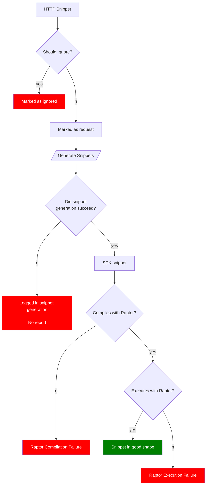

```mermaid
graph TD
    http_snippet[HTTP Snippet]
    should_ignore{Should Ignore?}
    ignored[Marked as ignored]
    request[Marked as request]
    generate_snippets[/Generate Snippets/]
    did_snippet_generation_succeed{Did snippet<br>generation succeed?}
    no_report[Logged in snippet generation<br><br>No report]
    sdk_snippet[SDK snippet]
    compiles_with_raptor{Compiles with Raptor?}
    raptor_compilation_failure[Raptor Compilation Failure]
    executes_with_raptor{Executes with Raptor?}
    raptor_compilation_failure[Raptor Compilation Failure]
    raptor_execution_failure[Raptor Execution Failure]
    sdk_snippet_in_good_shape[Snippet in good shape]

    http_snippet --> should_ignore
    should_ignore --yes--> ignored
    should_ignore --no--> request
    request --> generate_snippets --> did_snippet_generation_succeed
    did_snippet_generation_succeed --no--> no_report
    did_snippet_generation_succeed --yes--> sdk_snippet
    sdk_snippet --> compiles_with_raptor
    compiles_with_raptor --yes--> executes_with_raptor
    compiles_with_raptor --no--> raptor_compilation_failure
    executes_with_raptor --no--> raptor_execution_failure
    executes_with_raptor --yes--> sdk_snippet_in_good_shape

    classDef successStyle fill:green,color:white
    class sdk_snippet_in_good_shape successStyle

    classDef failureStyle fill:red,color:white
    class raptor_compilation_failure,raptor_execution_failure,no_report,ignored failureStyle
```