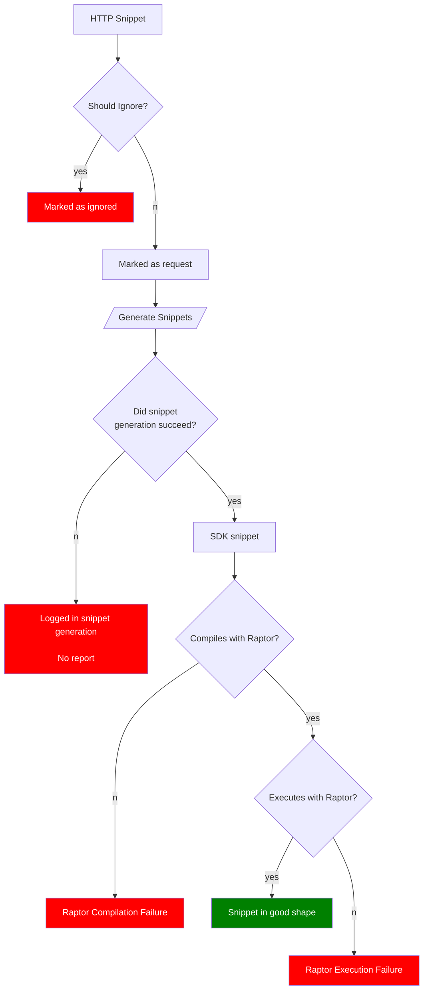

# Snippets as Raptor's Input

In Microsoft Graph documentation, the SDK snippets are generated from blocks that are marked as `request`. This is denoted as `"blockType": "request"` in the block metadata, such as:

```
<!---
{
    "blockType": "request",
    "name": "get_drive_children"
}
--->
```

There is also a `blockType` called `ignored`, which is used as a signal to ignore the block in snippet generation process. The primary purpose of the `ignored` block is not to decide whether or not to generate the snippet, but to exclude it from APIDoctor validation process. Examples of such blocks are the definitions of a request in a documentation page, such as:

```http
GET /me/drive/root/children
GET /users/{user-id}/drive/root/children
```

They usually appear before the example requests on each page.

From "APIDoctor validation" and "snippet generation" point of view, these blocks do not qualify as input as it doesn't include a single HTTP request object.

By relying on the `ignored` tag, a hack was introduced in the past to skip the snippet generation process for blocks where generated snippets were not in an expected format. This was an ad-hoc process, so there is no consistency in where these tags appear. In the future, we should ideally remove all `ignored` tags from example request blocks.

The decision to publish an SDK snippet can rely on whether the snippet generation process is successful (currently this fails if there is a mismatch in the API model and the given HTTP snippet or if there is a bug in snippet generation). A higher quality bar can be compiling the snippet in Raptor succeessfully before publishing it.

In Raptor's original design we did not make the compilation a hard requirement for publishing a snippet, because there were a lot of minor snippet generation bugs. The solutions for some of these bugs were relatively easy to figure out after copying the snippet into an IDE, such as casing of a type name (`wheelchair` vs `wheelChair`) or disambiguation of a collided type name (`DayOfWeek` vs `Microsoft.Graph.DayOfWeek`). We chose to have the close-enough snippet to be published instead of skipping it altogether until we identify all issues and fix them.

## How to identify ignored request blocks from other ignored blocks

They would have a name identifying the request. e.g.
```
<!---
{
    "blockType": "ignored",
    "name": "get_drive_children"
}
--->
```

as opposed to:
```
<!---{ "blockType": "ignored" }--->
```

## Current flow
